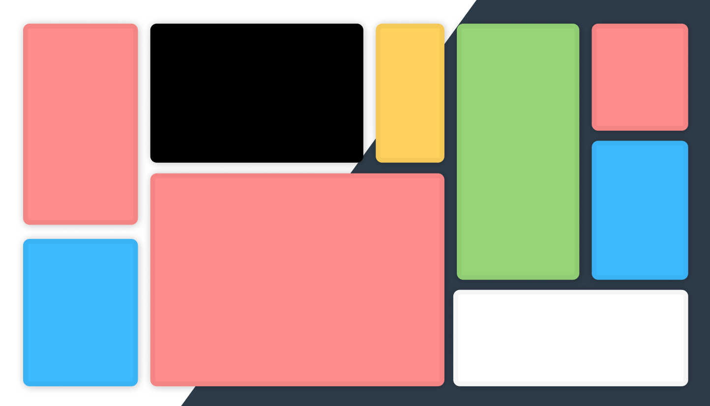

# [Polytask](https://polytaskdev.github.io/Polytask/)

A website that helps with multitasking during school by having some of the most common things you need. Think of it as your backpack, instead of having to bring calculator, dictionary, a clock/timer/stopwatch, a notebook to take note, etc, **just use [polytask](https://polytaskdev.github.io/Polytask/)**. It increase your productivity and it will help you enjoy and learn efficiently at the same time! website: https://polytaskdev.github.io/Polytask

  
  

## Program

Polytask is a website that is built with javascript, html, and css.

  
  

## Features

Polytask includes multiple features listed below:
- [x] A scientific calculator
-  [x] A built in Dictionary
-  [x] A timer/stopwatch/clock
-  [x] A notebook for taking notes
-  [x] Snake game, only if your done with your work :-)
-  [x] A button to add windows
-  [x] A button to delete all windows
-  [x] A button to switch to dark mode/light mode/auto
- [x] Keybindings
  
  

## Prerequisites

You need a:
- Web Browser
- A Computer
- A brain
- Oxygen

- A ready mindset to get A+

  
 
## How to run

To run Polytask you need to:

1. Go to [Polytask](https://polytaskdev.github.io/Polytask/)
2. Click the plus button on the website to add windows
3. Profit

  
  

## How to delete all windows

To delete all windows, you just need to:

1. Click the **x** in the upper right corner of the polytask website

2. Then the windows will be deleted

  ## Key-bindings
 Add a new note : `Shift + N`
 Add a new dictionary : `Shift + D`
 Add a new timer : `Shift + T`
 Add a new snake game : `Shift + S`
 Add a new Calculator : `Shift + C`
  

